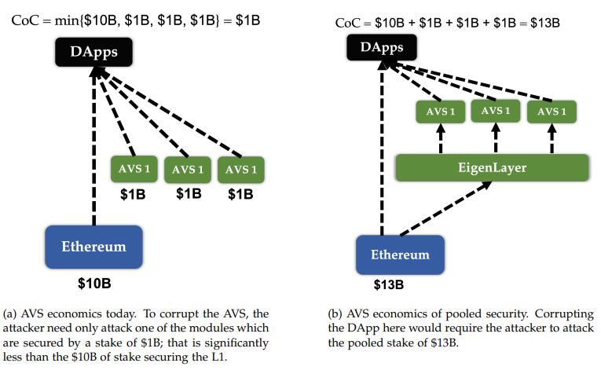
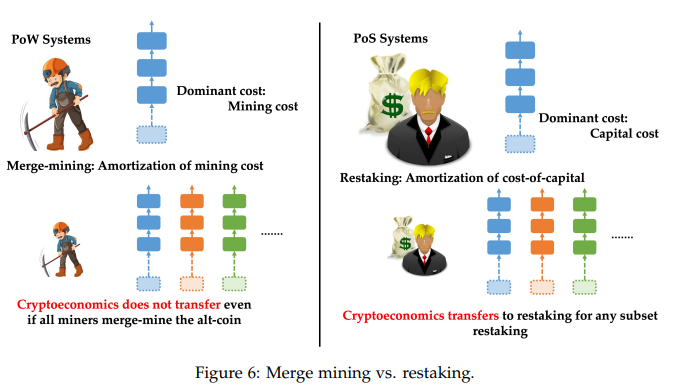
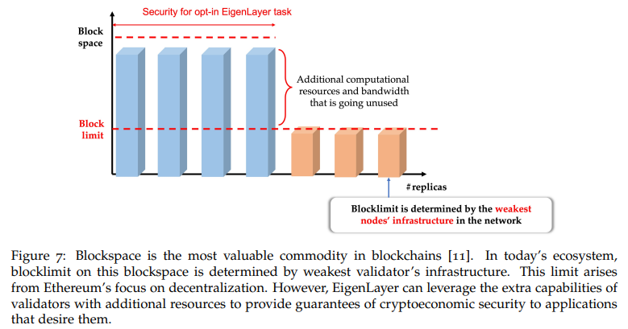

# Eigenlayer Whitepaper

[EignLayer Whitepaper PDF](https://docs.eigenlayer.xyz/assets/files/EigenLayer_WhitePaper-88c47923ca0319870c611decd6e562ad.pdf)

### About EigenLayer
EigenLayer serves as an open marketplace where AVSs can rent pooled
security provided by Ethereum validators.

Pooled security via restaking. EigenLayer provides a new mechanism for pooled security by
enabling modules to be secured by restaked ETH rather than their own tokens. In particular,
Ethereum validators can set their beacon chain withdrawal credentials to the EigenLayer smart
contracts, and opt into new modules built on EigenLayer. The validators download and run
any additional node software required for these modules. The modules then have the ability
to impose additional slashing conditions on the staked ETH of validators who opted into the
module. We call this mechanism restaking. In return, validators gain additional revenue from
providing security and validation services to their chosen modules. For example, if the module is a Data Availability layer, restakers via EigenLayer will receive a payment whenever data is stored through the module. In return, restakers are subject to slashing conditions that are exercised through proof-of-custody

Any AVS with an on-chain slashing contract can be secured by EigenLayer.

EigenLayer provides an open market mechanism which governs how its pooled security is supplied by validators and consumed by AVSs. EigenLayer creates a marketplace in which validators can choose whether to opt in or out of each module built on EigenLayer.

EigenLayer gives ETH stakers several additional revenue streams that they can participate in, and further consolidates the ecosystem’s network effects due to the presence of a highly secure AVS ecosystem.

1. Native restaking. Validators can restake their staked ETH natively by pointing their withdrawal
credentials to the EigenLayer contracts. This is equivalent to L1 → EigenLayer yield stacking.
2. LST restaking. Validators can restake by staking their LSTs, ETH already restaked via protocols
like Lido and Rocket Pool, by transferring their LSDs into the EigenLayer smart contracts. This
is equivalent to DeFi → EigenLayer yield stacking.
3. ETH LP restaking. Validators stake the LP token of a pair which includes ETH. This is equivalent
to DeFi → EL yield stacking.
4. LST LP restaking. Validators stake the LP token of a pair which includes a liquid staking ETH
token, such as Curve’s stETH-ETH LP token, thus taking the L1 → DeFi → EL yield stacking
route.
    
    ### Delegation in Eigenlayer
    
    Many of the EigenLayer restakers holding ETH or LSTs may be interested in participating in EigenLayer, but may not want to act as EigenLayer operators themselves. EigenLayer provides an avenue for these restakers to delegate their ETH or LSTs to other entities who are running EigenLayer operator nodes. EigenLayer operators who have stake delegated to them can deposit the delegated stake to spin up new Ethereum validator nodes, and subject the delegated stake to slashing from the modules the operator is participating in. These operators receive fees from both the Ethereum beacon chain and the modules they are participating in via EigenLayer. They keep a fraction of those fees and send through the remainder to the delegators.
    
    Solo Staking: In this model, solo stakers, who are natively restaked, have two options for participating in EigenLayer: (1) solo stakers can can opt in to AVSs on EigenLayer for which they can provide validation services directly; or (2) solo stakers can delegate EigenLayer operations to a different entity, while continuing to validate for Ethereum themselves. This latter option allows for home stakers with non-upgradeable / lightweight setups to continue contributing decentralization and censorship resistance to Ethereum (as well as not sharing the core Ethereum yield with any operator), while receiving additional rewards through EigenLayer via delegation to another operator. We envision that there will be many services built on EigenLayer that are designed to be lightweight, and suitable for home stakers who do not want to delegate their stake to another operator. For example, consider a decentralized price oracle, which is computationally easy to run, but requires high trust.
    
    Delegation Model: The delegation model in EigenLayer requires that delegate their stake to an operator. If their operator doesn’t fulfill its obligations in the EigenLayer modules that it is participating in, then their deposited stake will be subject to slashing. Restakers who have delegated their stake with this operator will be slashed too. Hence, EigenLayer restakers should only delegate to trusted operators who have a track record of successfully fulfilling their obligations. There are no incentives built into EigenLayer for delegating, but is possible for others to build innovative delegation frameworks on top of EigenLayer.
    
    ### EigenLayer Slashing
    
    Cryptoeconomic security quantifies the cost that an adversary must bear in order to cause a protocol to lose a desired security property. This is referred to as the Cost-of-Corruption (CoC). When CoC is much greater than any potential Profit-from-Corruption (PfC), we say that the system has robust security.
    
    A key function of the EigenLayer smart contracts is to hold the withdrawal credentials of Ethereum Proof-of-Stake (PoS) stakers. If a staker who is restaked on EigenLayer is proven to have behaved adversarially while participating in an AVS, then that staker’s ETH will be subject to slashing and are frozen, that is, prevented from further participation on any AVS on EigenLayer. Since the withdrawal address of the staker is set to the EigenLayer contracts, when the staker withdraws their ETH from participation in Ethereum consensus through EigenLayer, the withdrawn ETH will be slashed according to the on-chain slashing contract of the AVS.
    
    EigenLayer does not issue a fungible token representing restaked positions.
    
    With respect to security, restaking and merge mining are very different; while merge mining creates potential security vulnerabilites, restaking reinforces security.
    
    
    
    - Restaking transfers cryptoeconomic security to arbitrary subsets. In the case of PoS chains
    merged via restaking, the following recourse is possible: The incorrect state transition could be fraud-proofed on the main chain, whereupon the stake held by the malicious validators in the main chain would be slashed. This sort of escalation to the main chain would induce a cost of corruption proportional to the amount restaked into the small chain. We note that we do not require all ETH stakers to participate in EigenLayer to ensure cryptoeconomic security to transfer, since any subset of stakers imposes the corresponding cryptoeconomic cost.
    • Merge mining does not transfer cryptoeconomic security. For PoW chains, even if all the
    miners of the main-chain opt in to the merge-mined chain, there is no significant cryptoeconomic security. Firstly, the option of slashing—which would amount to the disabling or removal of the malicious miners’ mining hardware — is not available. Moreover, even if the smaller chain loses value due to token toxicity, i.e., there is a loss of value due to the merge-mined chain now losing utility, the hardware capital of miners would continue to have value due to the existence of the main chain whose token would not experience comparable toxicity
    
    The second line of defense before an AVS ossifies is that there is a governance layer in
    Eigenlayer comprised of prominent members of the Ethereum and EigenLayer community, which has
    the ability to veto slashing decisions via a multisig.
    
    ### A World with EigenLayer
    
    
    
    A list of some possibilities with EigenLayer -
    
    - Hyperscale Data Availability Layer
    - Decentralized Sequencers
        - Many rollups require decentralized sequencers for managing their own Mev and censorship resistance. These sequencers can be built on EigenLayer with a quorum of ETH stakers — there can be a single decentralized sequencer quorum that perfoms the service for many rollups
    - Light-Node bridges
        - It is possible for restakers to verify off-chain whether bridge inputs are correct, and if a strong cryptoeconomic quorum signs off on a bridge input, then the bridge input is considered accepeted.
    - Fast-Mode Bridges for Rollups
        - For Zk rollups, since the proof verification expense on Ethereum is still high, rollup sequencers write to Ethereum somewhat infrequently, affecting composability and delaying confirmation guarantees. It is possible for a quorum of operators on EIgenLayer with a large amount of Eth restaked to participate in ZK proof verification off-chain, and to certify that proofs are correct on-chain.
    - Oracles
    - Opt-in Event-Driven Activation
        - Event-driven activations such as liquidations and collateral transfers are currently not available natively on Ethereum. In EigenLayer, Ethereum validators who happen to be block proposers are also opted-in to restaking on EigenLayer for an event driven activation AVS can provide strong gurantees on inclusion of event-driven actions, at the risk of getting slashed.
    - Opt-In Mev Management
        - A simple example, MEV smoothing can be built on top of EigenLayer by a group of restakers that decide to share MEV equally among its members.
    - Settlement Chains with Ultra-Low Latency
        - Ethereum has high latency to get economic finality (up to 12 minutes), and hence it may be useful to have a fast settlement with high economic finality. EigenLayer allows the creation of restaked sidechains where ETH restakers can participate in new consensus protocols, some of which have very low latency and very high througput.
    - Single-Slot Finality
        - The core idea would be that nodes who have restaked can now attest that they will not build on a chain that does not include the testified block, thus creating a potential finality pathway. Designing this so that it is truly opt-in and does not break the consensus protocol is an important direction of research.
        
        ### EigenLayer can incentivize Ethereum Staker Decentralization
        
        One example is a threshold encryption system for on-chain privacy. If majority of the keys are held by one centralized entity, then privacy can be broken by this centralized
        entity before the stipulated period in a non-attributable manner. 
        
        With EigenLayer, an AVS can explicitly specify that the stake/nodes participating in its validation tasks must be part of a decentralized quorum. More explicitly, the AVS can specify in its contracts while integrating with EigenLayer that only Ethereum home validators can participate in its tasks, thus contributing to keeping the AVS decentralized
        
        ### Multi-token Quorums
        
        EigenLayer offers flexibility for AVSs to define their own quorum alongside a quorum comprised of restaked ETH, and require the final response to its validation tasks to be a function of responses from a majority of each quorum. For example, an AVS can specify two quorums, an Ethereum restakers quorum and an $AVS quorum (where $AVS is the AVS’s token). In order for any operator on EigenLayer to perform services for this AVS, they either have to restake their ETH or they have to stake $AVS token. The AVS can treat both quorums as two independent quorums and use an AND clause to combine the majority response from both the quorums. This flexibility to define multiple quorums offers an opportunity to the AVS to bootstrap its own token as a utility token and accrue value to its protocol, while using the restaked ETH quorum to hedge against a death spiral of its own token.
        
        ### Summary
        
        1. EigenLayer creates a free market for decentralized trust, delivered from Ethereum stakers to modules that desire stake and validation services.
        2. By restaking via EigenLayer, Ethereum stakers can opt into providing security and validation services to modules of their choice, either by operating nodes directly, or via delegation to other EigenLayer operators.
        3. A variety of lightweight and hyperscale modules can be built on EigenLayer, which can be designed for widespread participation from solo stakers.
        4. Modules may also take advantage of significant heterogeneity between stakers, which may differ on axes of computational capacity, risk/reward preferences, and identity.
        5. EigenLayer seeks to enable more agile, decentralized, and permissionless innovation on blockchains.